# 🛍️ E-Commerce Clothing Platform

A modern, full-stack e-commerce platform for selling clothing items, built with React, NestJS, and MySQL.

**Author:** [Ali Al-Dirawi](https://github.com/deskram)

## 📦 Repositories

This project is split into separate repositories:

- **Frontend**: [frontendE-commerceapp](https://github.com/ALkhansaaEva/frontendE-commerceapp) - React + Vite frontend application
- **Backend**: [backendE-commerceapp](https://github.com/ALkhansaaEva/backendE-commerceapp) - NestJS backend API

For detailed documentation:
- Frontend documentation: See [frontend README](https://github.com/ALkhansaaEva/frontendE-commerceapp/blob/main/README.md)
- Backend documentation: See [backend README](https://github.com/ALkhansaaEva/backendE-commerceapp/blob/main/README.md)

## 📸 Project Overview

<div align="center">

### 🏠 Homepage
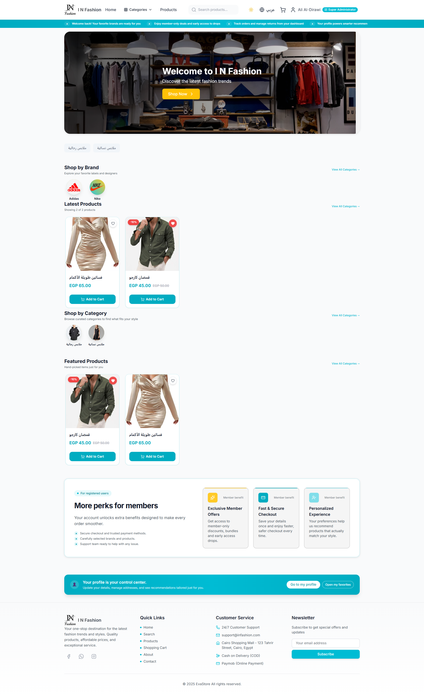
*Modern and responsive homepage with featured products and categories*

### 🛍️ Product Listing
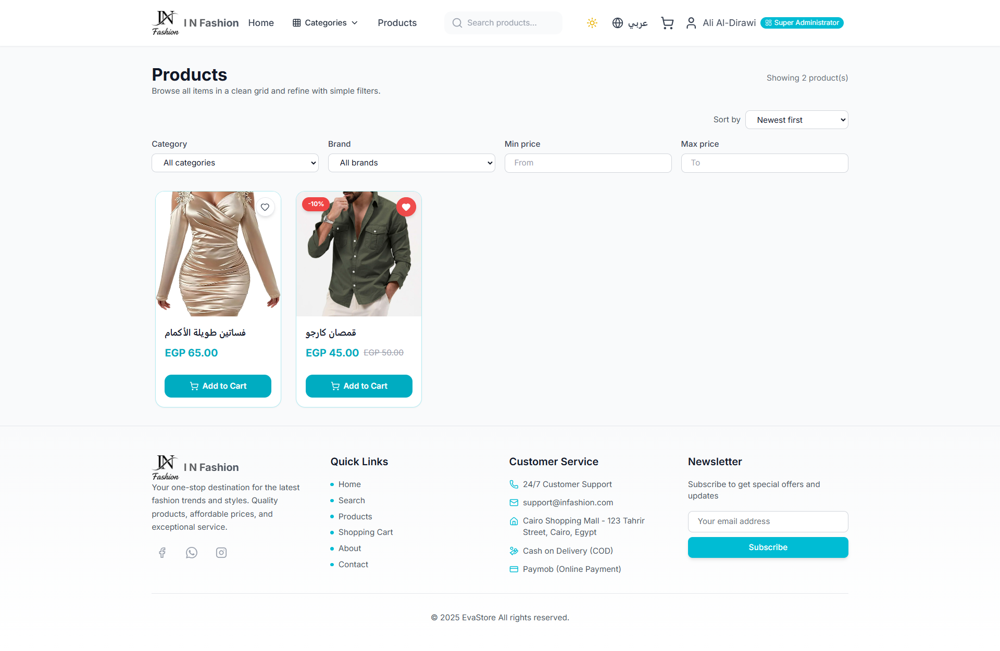
*Browse products with advanced filters and search functionality*

### 📦 Product Details
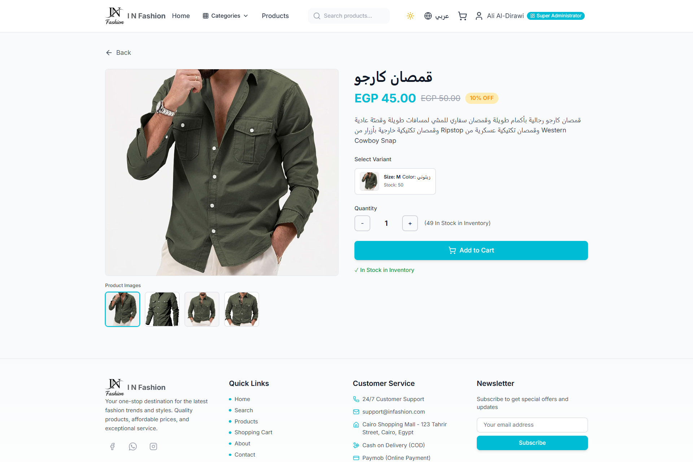
*Detailed product view with images, variants, and specifications*

### 🛒 Shopping Cart
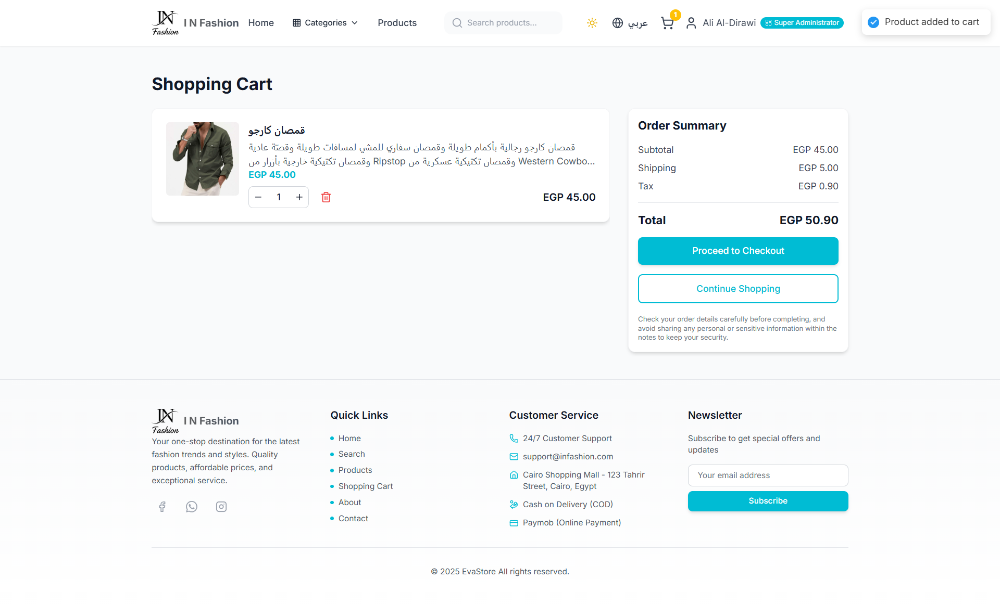
*Interactive shopping cart with quantity management*

### 💳 Checkout
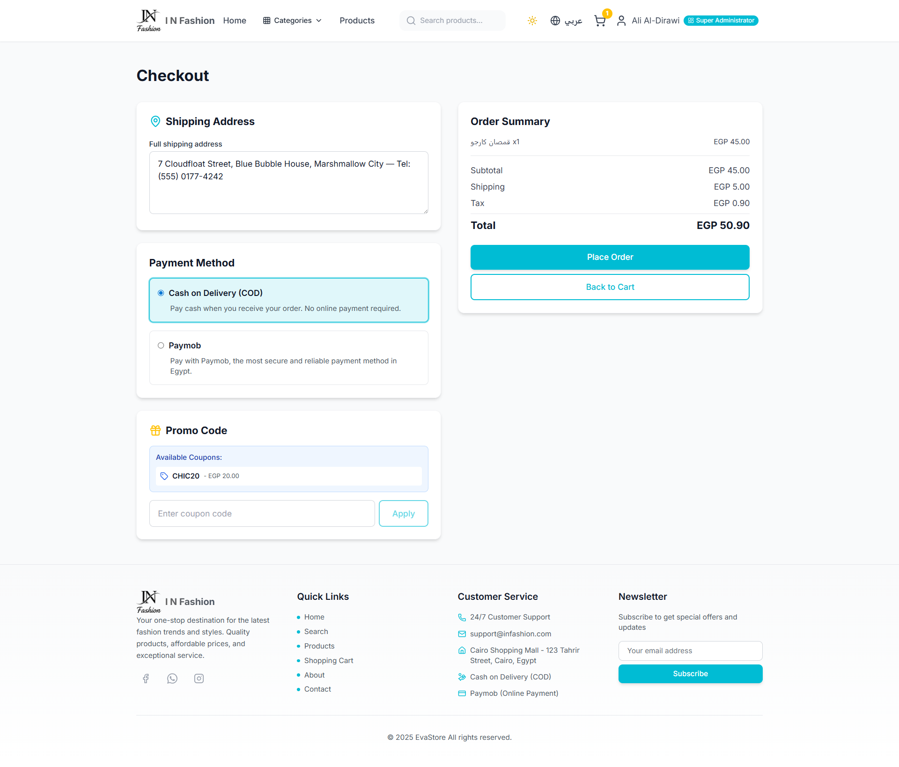
*Streamlined checkout process with address management*

### 👤 User Profile
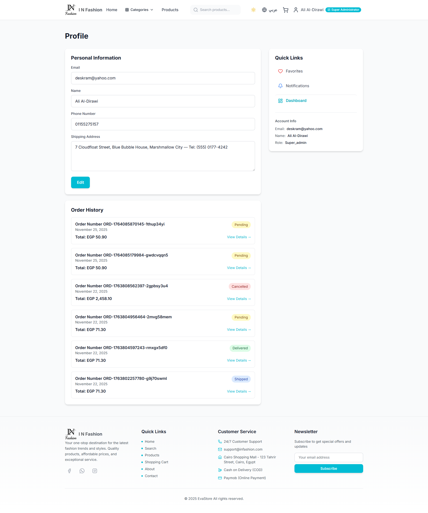
*User profile with order history and saved addresses*

### 📊 Admin Dashboard
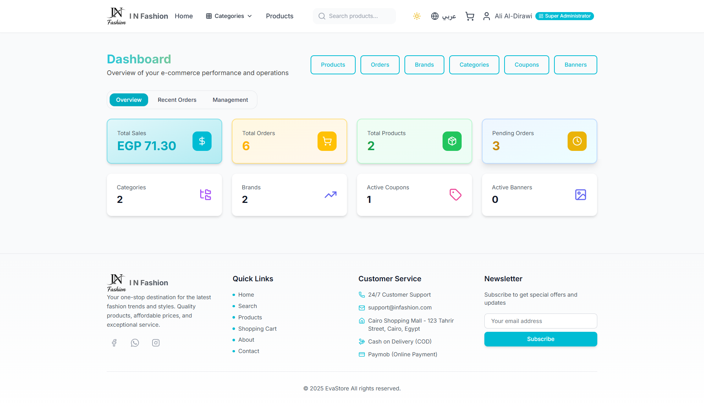
*Comprehensive admin dashboard with analytics and metrics*

### 📦 Admin Products
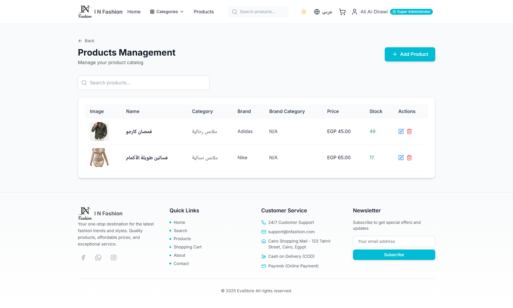
*Product management interface for admins*

### 📋 Admin Orders
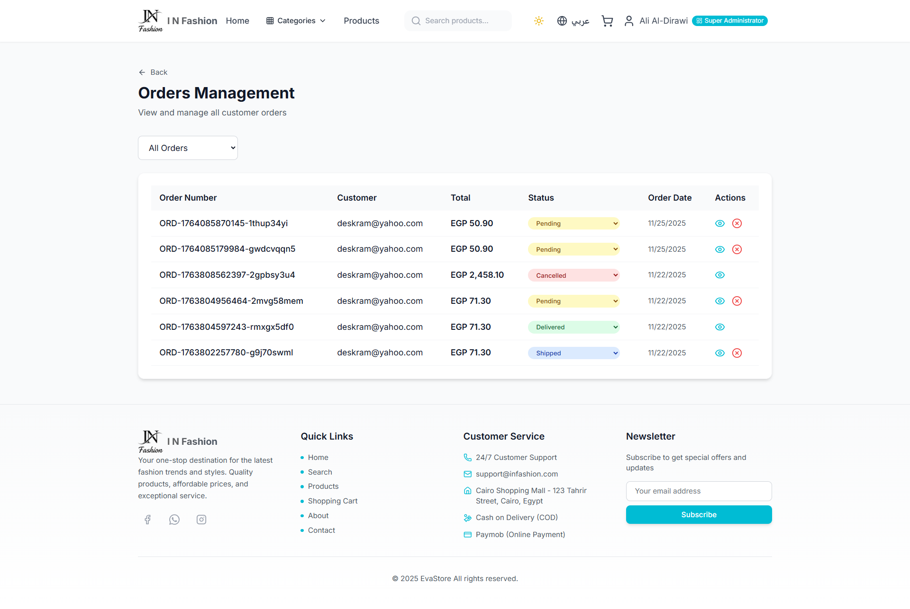
*Order management and tracking system*

### 📱 Mobile View
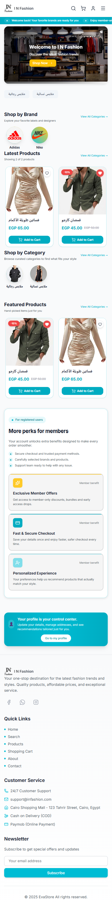
*Fully responsive design for mobile devices*

### 🌓 Dark Mode
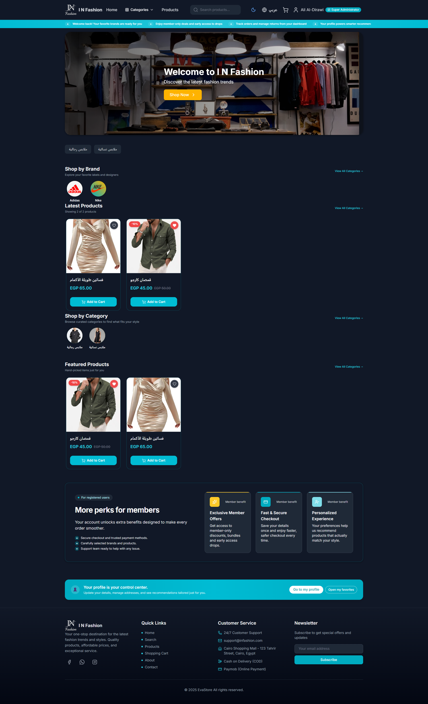
*Beautiful dark theme support*

</div>

> **Note:** Add your project screenshots to the `images/` folder. Replace the placeholder image paths above with your actual screenshots.

## 📋 Table of Contents

- [Project Overview](#-project-overview)
- [Features](#-features)
- [Tech Stack](#-tech-stack)
- [Project Structure](#-project-structure)
- [Prerequisites](#-prerequisites)
- [Quick Start](#-quick-start)
- [Docker Setup](#-docker-setup)
- [Manual Setup](#-manual-setup)
- [Environment Variables](#-environment-variables)
- [API Documentation](#-api-documentation)
- [Development](#-development)
- [Deployment](#-deployment)
- [Author](#-author)
- [Contributing](#-contributing)
- [License](#-license)

## ✨ Features

### Customer Features
- 🛍️ **Product Browsing** - Browse products by category, brand, and filters
- 🔍 **Advanced Search** - Search with filters (size, price, brand, category)
- 🛒 **Shopping Cart** - Add, update, and remove items
- 💳 **Checkout** - Secure checkout with cash on delivery
- ⭐ **Favorites** - Save favorite products
- 📦 **Order Tracking** - Track order status in real-time
- 🔔 **Notifications** - Email notifications for order updates
- 👤 **User Profile** - Manage personal information and addresses
- 🌐 **Multi-language** - English and Arabic support
- 🌓 **Dark Mode** - Light and dark theme support

### Admin Features
- 📊 **Dashboard** - Analytics and key metrics
- 📦 **Product Management** - CRUD operations for products
- 🏷️ **Category Management** - Manage categories and subcategories
- 🏢 **Brand Management** - Manage brands
- 🎫 **Coupon System** - Create and manage discount coupons (including 100% discounts)
- 📋 **Order Management** - Track and update order statuses
- 👥 **User Management** - View and manage users
- 📧 **Email Notifications** - Automated email notifications

### Technical Features
- 🔐 **Multiple Auth Methods** - Google OAuth, Facebook OAuth, Email + OTP
- 🚀 **High Performance** - Optimized queries and efficient data handling
- 📸 **Image Upload** - Product image management
- 🔄 **Real-time Updates** - Order status updates
- 📱 **Responsive Design** - Mobile, tablet, and desktop support

## 🛠️ Tech Stack

### Frontend
- **React 19** - UI library
- **TypeScript** - Type safety
- **Vite** - Build tool
- **Tailwind CSS** - Styling
- **React Router** - Routing
- **TanStack Query** - Data fetching
- **React Hook Form** - Form management
- **Zod** - Validation
- **i18next** - Internationalization
- **Framer Motion** - Animations

### Backend
- **NestJS** - Node.js framework
- **Fastify** - HTTP server
- **TypeORM** - ORM
- **MySQL** - Database
- **JWT** - Authentication
- **Passport** - Auth strategies
- **Nodemailer** - Email service
- **Multer** - File uploads

## 📁 Project Structure

This project consists of two separate repositories:

### Frontend Repository
```
frontendE-commerceapp/
├── src/
│   ├── components/    # Reusable components
│   ├── pages/         # Page components
│   ├── context/       # React contexts
│   ├── hooks/         # Custom hooks
│   ├── services/      # API services
│   └── utils/         # Utilities
├── Dockerfile
└── package.json
```

**Repository**: [frontendE-commerceapp](https://github.com/ALkhansaaEva/frontendE-commerceapp)

### Backend Repository
```
backendE-commerceapp/
├── src/
│   ├── auth/          # Authentication
│   ├── products/      # Products module
│   ├── categories/    # Categories module
│   ├── brands/        # Brands module
│   ├── orders/        # Orders module
│   ├── cart/          # Cart module
│   ├── coupons/       # Coupons module
│   └── ...
├── Dockerfile
└── package.json
```

**Repository**: [backendE-commerceapp](https://github.com/ALkhansaaEva/backendE-commerceapp)

> **Note**: For local development with Docker Compose, you can clone both repositories into a parent directory and use a shared `docker-compose.yml` file.

## 📦 Prerequisites

- **Node.js** >= 20.x
- **npm** >= 9.x
- **Docker** >= 20.x (optional, for Docker setup)
- **Docker Compose** >= 2.x (optional)
- **MySQL** >= 8.0 (if not using Docker)

## 🚀 Quick Start

### Using Docker (Recommended)

1. **Clone the repositories**
   ```bash
   # Clone frontend
   git clone https://github.com/ALkhansaaEva/frontendE-commerceapp.git
   cd frontendE-commerceapp
   
   # Clone backend (in a separate directory)
   cd ..
   git clone https://github.com/ALkhansaaEva/backendE-commerceapp.git
   cd backendE-commerceapp
   ```

2. **Create environment file**
   ```bash
   cp .env.example .env
   # Edit .env with your configuration
   ```

3. **Start all services**
   ```bash
   docker-compose up -d
   ```

4. **Access the application**
   - Frontend: http://localhost:5173
   - Backend API: http://localhost:3000/api
   - MySQL: localhost:3306

5. **View logs**
   ```bash
   docker-compose logs -f
   ```

6. **Stop services**
   ```bash
   docker-compose down
   ```

### Manual Setup

See [Manual Setup Guide](#-manual-setup) below.

## 🐳 Docker Setup

### Individual Repository Docker Setup

Each repository has its own Dockerfile. For Docker Compose setup with both repositories:

1. **Clone both repositories** into a parent directory
2. **Create a `docker-compose.yml`** file in the parent directory
3. **Reference both repositories** in the compose file

### Docker Commands

For individual services:

```bash
# Backend
cd backendE-commerceapp
docker build -t ecommerce-backend .
docker run -p 3000:3000 --env-file .env ecommerce-backend

# Frontend
cd frontendE-commerceapp
docker build -t ecommerce-frontend .
docker run -p 80:80 ecommerce-frontend
```

### Environment Variables for Docker

For backend, create a `.env` file in the `backendE-commerceapp` directory:

```env
# Database
DB_ROOT_PASSWORD=rootpassword
DB_DATABASE=ecommerce_db
DB_USERNAME=ecommerce_user
DB_PASSWORD=ecommerce_password
DB_PORT=3306

# Backend
BACKEND_PORT=3000
NODE_ENV=production

# Frontend
FRONTEND_PORT=5173

# JWT
JWT_SECRET=your-super-secret-jwt-key-change-in-production
JWT_EXPIRES_IN=7d
JWT_REFRESH_SECRET=your-super-secret-refresh-key-change-in-production
JWT_REFRESH_EXPIRES_IN=30d

# CORS
CORS_ORIGIN=http://localhost:5173,http://localhost:3001

# Email
EMAIL_HOST=smtp.gmail.com
EMAIL_PORT=587
EMAIL_USER=your_email@gmail.com
EMAIL_PASS=your_app_password

# OAuth (optional)
GOOGLE_CLIENT_ID=your_google_client_id
GOOGLE_CLIENT_SECRET=your_google_client_secret
FACEBOOK_APP_ID=your_facebook_app_id
FACEBOOK_APP_SECRET=your_facebook_app_secret
```

## 🔧 Manual Setup

### Backend Setup

1. **Clone the backend repository**
   ```bash
   git clone https://github.com/ALkhansaaEva/backendE-commerceapp.git
   cd backendE-commerceapp
   ```

2. **Install dependencies**
   ```bash
   npm install
   ```

3. **Create `.env` file**
   ```bash
   cp .env.example .env
   # Edit .env with your configuration
   ```

4. **Start MySQL** (if not using Docker)

5. **Run database migrations** (if needed)
   ```bash
   npm run typeorm migration:run
   ```

6. **Seed database** (optional)
   ```bash
   npm run seed
   ```

7. **Start development server**
   ```bash
   npm run start:dev
   ```

### Frontend Setup

1. **Clone the frontend repository**
   ```bash
   git clone https://github.com/ALkhansaaEva/frontendE-commerceapp.git
   cd frontendE-commerceapp
   ```

2. **Install dependencies**
   ```bash
   npm install
   ```

3. **Create `.env` file**
   ```bash
   echo "VITE_API_URL=http://localhost:3000/api" > .env
   ```

4. **Start development server**
   ```bash
   npm run dev
   ```

## 🔐 Environment Variables

### Backend Environment Variables

See [backend README](https://github.com/ALkhansaaEva/backendE-commerceapp/blob/main/README.md) for detailed backend environment variables.

### Frontend Environment Variables

- `VITE_API_URL` - Backend API URL (default: `http://localhost:3000/api`)

See [frontend README](https://github.com/ALkhansaaEva/frontendE-commerceapp/blob/main/README.md) for detailed frontend environment variables.

## 📡 API Documentation

The API is available at `http://localhost:3000/api`. Key endpoints:

- **Authentication**: `/api/auth/*`
- **Products**: `/api/products/*`
- **Categories**: `/api/categories/*`
- **Brands**: `/api/brands/*`
- **Cart**: `/api/cart/*`
- **Orders**: `/api/orders/*`
- **Coupons**: `/api/coupons/*`

For detailed API documentation, see [backend README](https://github.com/ALkhansaaEva/backendE-commerceapp/blob/main/README.md).

## 💻 Development

### Running in Development Mode

1. **Start MySQL** (using Docker or locally)
   ```bash
   docker-compose up -d mysql
   ```

2. **Start Backend** (in one terminal)
   ```bash
   cd backendE-commerceapp
   npm run start:dev
   ```

3. **Start Frontend** (in another terminal)
   ```bash
   cd frontendE-commerceapp
   npm run dev
   ```

### Code Style

- **Backend**: Follows NestJS conventions
- **Frontend**: Uses ESLint and Prettier

### Testing

```bash
# Backend tests
cd backendE-commerceapp
npm run test
npm run test:e2e

# Frontend tests (if configured)
cd frontendE-commerceapp
npm run test
```

## 🚀 Deployment

### Production Build

1. **Build Backend**
   ```bash
   cd backendE-commerceapp
   npm run build
   npm run start:prod
   ```

2. **Build Frontend**
   ```bash
   cd frontendE-commerceapp
   npm run build
   ```

3. **Using Docker**
   
   For Docker setup, you'll need to create a `docker-compose.yml` file that references both repositories. See the individual repository READMEs for Docker instructions:
   - [Backend Docker Setup](https://github.com/ALkhansaaEva/backendE-commerceapp#deployment)
   - [Frontend Docker Setup](https://github.com/ALkhansaaEva/frontendE-commerceapp#deployment)

### Environment Setup

- Set `NODE_ENV=production`
- Configure production database credentials
- Set secure JWT secrets
- Configure email service
- Set up SSL certificates
- Configure CORS for production domain

## 👤 Author

**Ali Al-Dirawi**

- GitHub: [@deskram](https://github.com/deskram)

## 🤝 Contributing

1. Fork the repository
2. Create a feature branch (`git checkout -b feature/amazing-feature`)
3. Commit your changes (`git commit -m 'Add some amazing feature'`)
4. Push to the branch (`git push origin feature/amazing-feature`)
5. Open a Pull Request

## 📄 License

This project is licensed under the MIT License.

## 📞 Support

For support, email alialdirawi@hotmail.com or open an issue in the repository.

## 🙏 Acknowledgments

- [NestJS](https://nestjs.com/) - Progressive Node.js framework
- [React](https://react.dev/) - UI library
- [Vite](https://vitejs.dev/) - Build tool
- [Tailwind CSS](https://tailwindcss.com/) - CSS framework

---

**Built with ❤️ by [Ali Al-Dirawi](https://github.com/deskram) for modern e-commerce**

